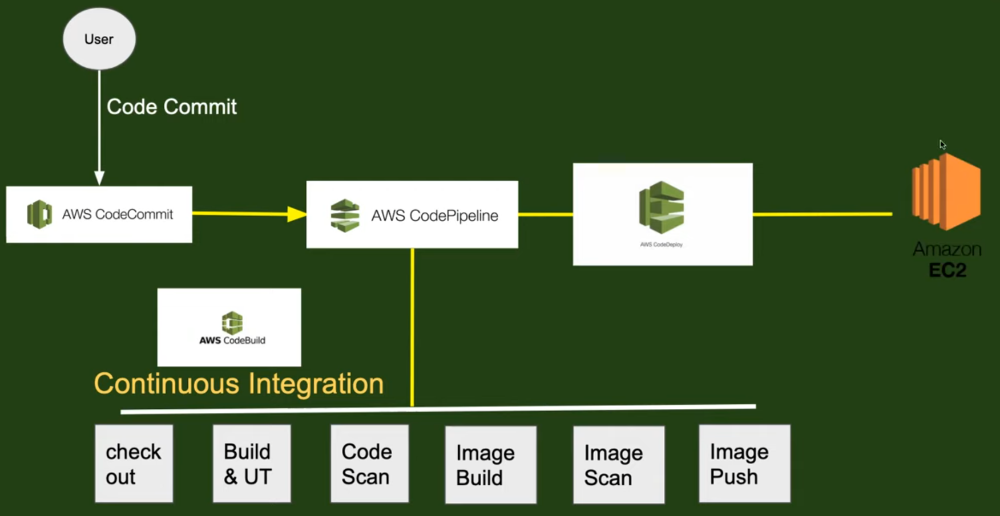

# AWS CI/CD for Python Application

This project sets up a complete CI/CD pipeline for deploying a Python application using AWS services. The pipeline automates code integration, building, and deployment to ensure efficient, scalable, and reliable application delivery.

## Project Overview

The CI/CD pipeline includes:
- **AWS CodePipeline**: Orchestrates the entire CI/CD process.
- **AWS CodeCommit**: Stores the Python application code.
- **AWS CodeBuild**: Builds the application and creates a Docker image.
- **AWS CodeDeploy**: Deploys the application to AWS ECS with Blue/Green deployment strategy.
- **Amazon ECR**: Stores the Docker image for the application.
- **Amazon ECS**: Hosts the Python application in a scalable, managed environment.

## Tools

- **AWS CodePipeline**
- **AWS CodeCommit**
- **AWS CodeBuild**
- **AWS CodeDeploy**
- **Amazon ECR**
- **Amazon ECS**
- **Python**

## Features

- Automated CI/CD pipeline for Python application.
- Blue/Green deployment strategy for zero-downtime releases.
- Scalable deployment using Amazon ECS and Docker.
